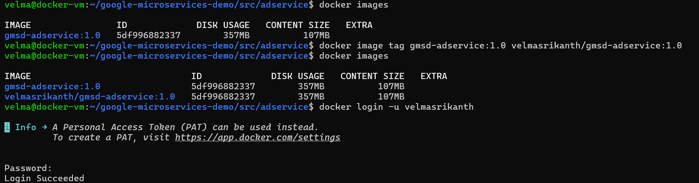
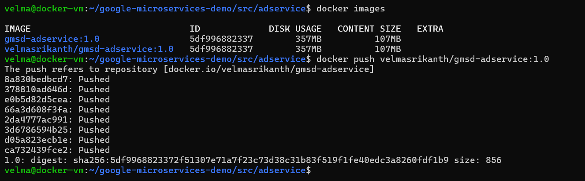

# Docker Images Creation & Management

After creating the **Dockerfile** and building the image, we can use the image to run containers.

## 1. Building Images (`docker build`)

Build an image from a Dockerfile.

**Syntax:**
```bash
docker build [options] <path_or_url>
```

**Options:**
| Option | Description |
| :--- | :--- |
| `-t`, `--tag <name:tag>` | Name and optionally a tag in the 'name:tag' format. |
| `-f`, `--file <file>` | Name of the Dockerfile (Default is 'PATH/Dockerfile'). |
| `--no-cache` | Do not use cache when building the image. |
| `--build-arg <var>` | Set build-time variables. |
| `--target <stage>` | Set the target build stage to build. |

**Example:**
```bash
docker build -t my-app:1.0 .
```

---

## 2. Listing Images (`docker images`)

List the images present on the local system.

**Syntax:**
```bash
docker images [options] [repository[:tag]]
```

**Options:**
| Option | Description |
| :--- | :--- |
| `-a`, `--all` | Show all images (default hides intermediate images). |
| `-q`, `--quiet` | Only show numeric IDs. |
| `--format <string>` | Pretty-print images using a Go template. |

**Example:**
```bash
docker images
docker images -a
```

---

## 3. Tagging Images (`docker tag`)

Create a tag TARGET_IMAGE that refers to SOURCE_IMAGE.

**Syntax:**
```bash
docker tag <source_image[:tag]> <target_image[:tag]>
```

**Example:**
```bash
docker tag my-app:latest my-registry/my-app:v1
```

---

## 4. Pushing and Pulling

Interact with a container registry (like Docker Hub).

### `docker push`
Push an image or a repository to a registry.

**Syntax:**
```bash
docker push [options] <name[:tag]>
```

**Example:**
```bash
docker push myuser/my-app:1.0
```

### `docker pull`
Pull an image or a repository from a registry.

**Syntax:**
```bash
docker pull [options] <name[:tag]>
```

**Example:**
```bash
docker pull nginx:latest
```

---

## 5. Removing Images (`docker rmi`)

Remove one or more images.

**Syntax:**
```bash
docker rmi [options] <image_id_or_name>
```

**Options:**
| Option | Description |
| :--- | :--- |
| `-f`, `--force` | Force removal of the image. |
| `--no-prune` | Do not delete untagged parents. |

**Examples:**
```bash
docker rmi my-app:1.0
docker rmi $(docker images -q) # Remove all images
```

### `docker image prune`
Remove unused images (dangling images).

**Options:**
*   `-a`, `--all`: Remove all images not used by at least one container (not just dangling ones).
*   `-f`, `--force`: Do not prompt for confirmation.

---

## 6. Inspection & History

### `docker inspect`
Return low-level information on Docker objects.

**Example:**
```bash
docker inspect nginx:latest
```

### `docker history`
Show the history of an image (layers).

**Example:**
```bash
docker history my-app:latest
```

## Docker Image Creation & Tagging & Pushing to Docker Hub/any registry

* First we need to create the image using the Dockerfile
* Then we need to tag the image with the registry name
* Then we need to login to the registry with a password or PAT with `docker login` with required permissions - read and write
* Then we need to push the image to the registry

```bash
docker build -t gmsd-adservice:1.0 .
docker image tag gmsd-adservice:1.0 velmasrikanth/gmsd-adservice:1.0 
docker login -u velmasrikanth 
docker push velmasrikanth/gmsd-adservice:1.0
```



## Docker Image Pulling from Docker Hub/any registry

* First we need to login to the registry with a password or PAT with `docker login` with required permissions - read and write
* Then we need to pull the image from the registry

```bash
docker login -u velmasrikanth
docker pull velmasrikanth/gmsd-adservice:1.0
```


