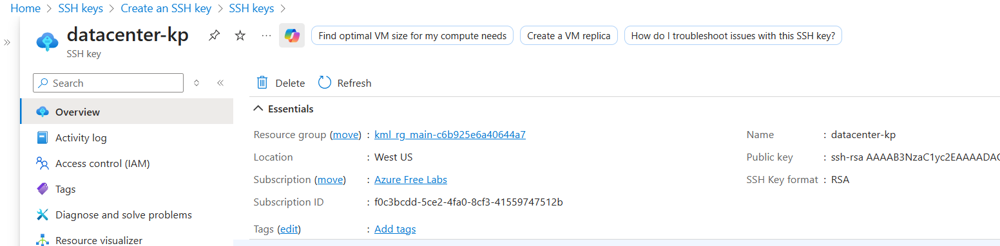
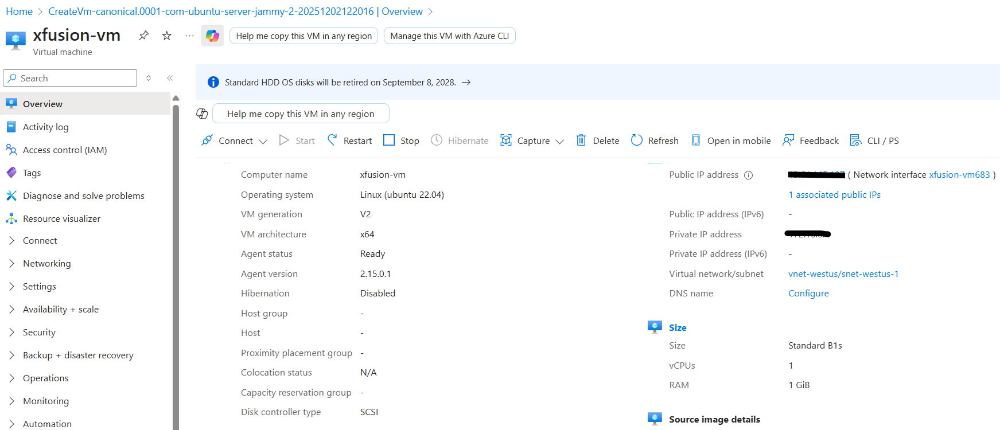
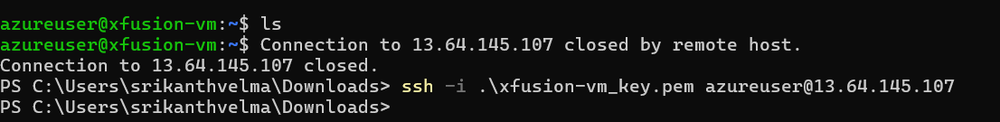

## Day 1: Create SSH Key Pair for Azure Virtual Machine
We have to simply create a new **SSH key** In azure portal with type **RSA** and given name

## Day 2: Create an Azure Virtual Machine
The requirements are:

1) Use the existing resource group.

2) The VM name must be xfusion-vm, it should be in West US region.

3) Use the Ubuntu 22.04 LTS image for the VM.

4) The VM size must be Standard_B1s.

5) Attach a default Network Security Group (NSG) that allows inbound SSH (port 22).

6) Attach a 30 GB storage disk of type Standard HDD.

7) The rest of the configurations should remain as default.

After completing these steps, make sure you can SSH into the virtual machine.

Create a simple azure with the above requirements with SSH Key or Password based, you have to access that in your local 



## Day 3: Create an Azure VM through CLI
1) Create a new Azure Virtual Machine named datacenter-vm using the Azure CLI.

2) Use the Ubuntu2204 image and set the VM size to Standard_B2s.

3) Make sure the admin username is set to azureuser and SSH keys are generated for secure access.

4) Use Standard_LRS storage account, disk size must be 30GB and ensure the VM datacenter-vm is in the running state after creation.

```sh
az vm create \
    --resource-group kml_rg_main-eeef3060ff8e4978 \
    --name nautilus-vm \
    --image ubuntu2204 \
    --size Standard_B2s \
    --admin-username azureuser \
    --generate-ssh-keys \
    --os-disk-size-gb 30 \
    --storage-sku Standard_LRS
```


