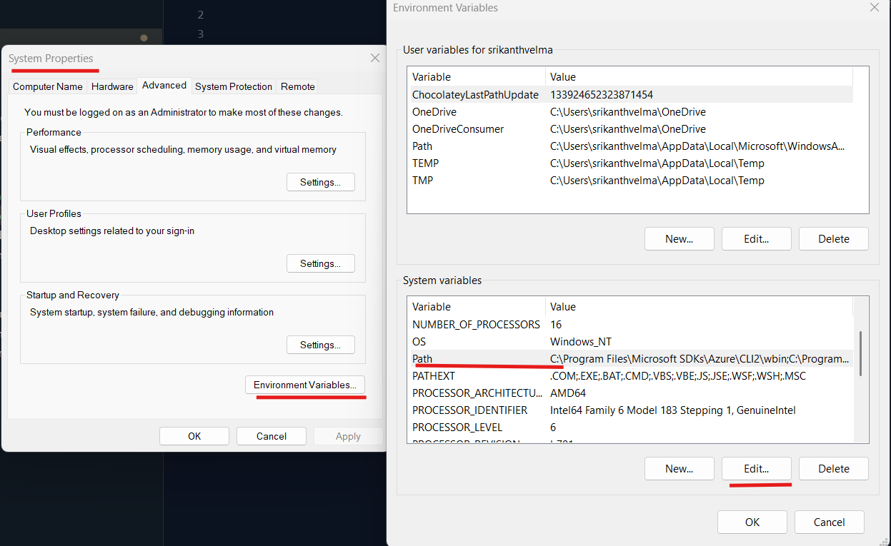
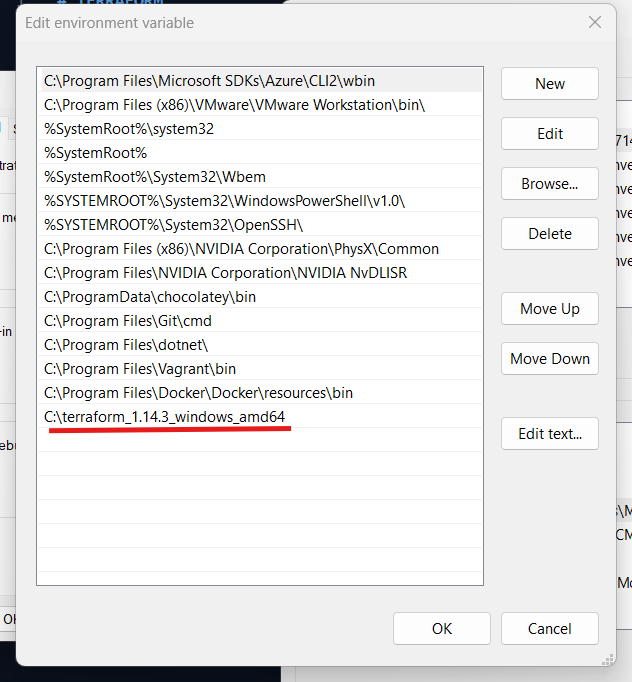

# TERRAFORM
## What is Terraform?
* Terraform is a Infrastructure as Code (IaC) tool that is used to manage and provision infrastructure resources.
## Why Terraform?


## Installation
[Refer] (https://developer.hashicorp.com/terraform/install)  To install terraform based on OS
* First we should configure the Cloud Cli (Azure Cli / Aws Cli / Gcloud)

### Windows
* Download the terraform.exe from [here](https://developer.hashicorp.com/terraform/install) 
* Extract the zip file and copy to another folder
* Add the terraform.exe to the system path - start Menu -> Edit system variables -> system properties -> advanced -> environment variables -> system variables -> path -> edit -> click on new -> add the path of terraform.exe -> click on ok.



### Linux
* For UBUNTU
```bash
wget -O - https://apt.releases.hashicorp.com/gpg | sudo gpg --dearmor -o /usr/share/keyrings/hashicorp-archive-keyring.gpg
echo "deb [arch=$(dpkg --print-architecture) signed-by=/usr/share/keyrings/hashicorp-archive-keyring.gpg] https://apt.releases.hashicorp.com $(grep -oP '(?<=UBUNTU_CODENAME=).*' /etc/os-release || lsb_release -cs) main" | sudo tee /etc/apt/sources.list.d/hashicorp.list
sudo apt update && sudo apt install terraform
```


