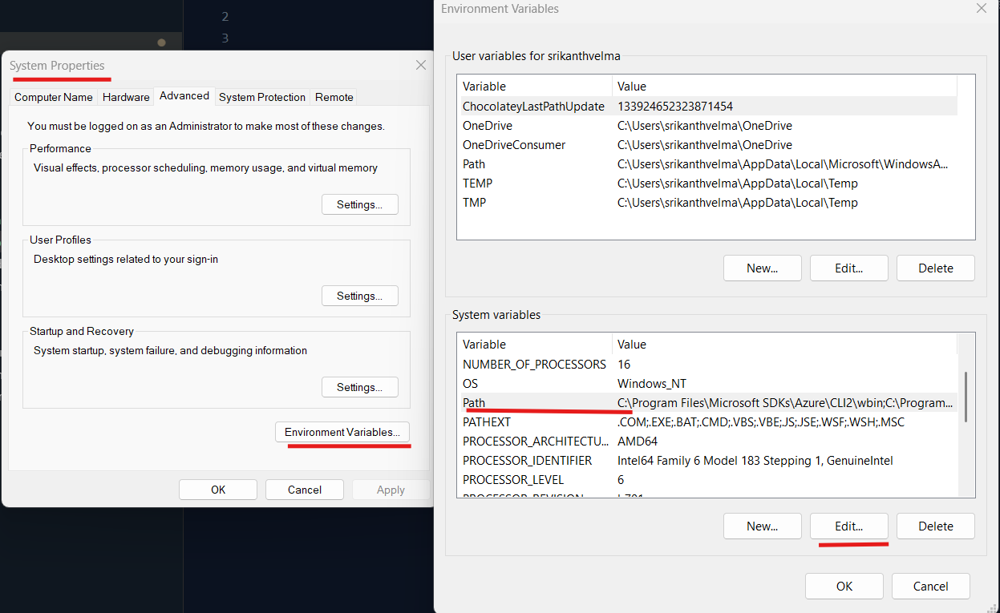
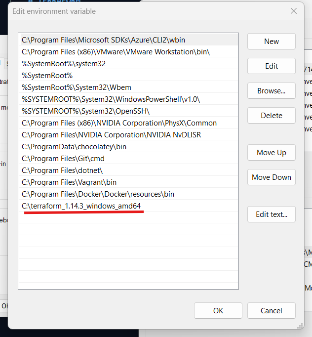
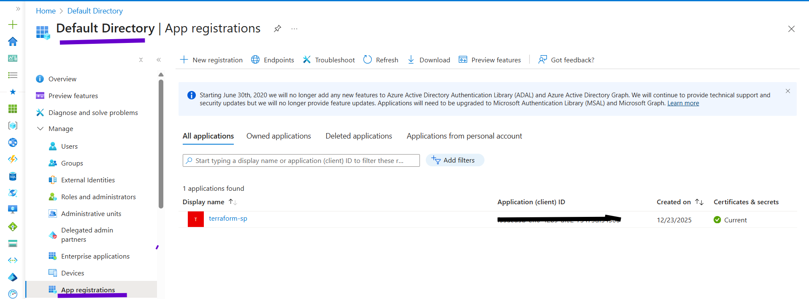
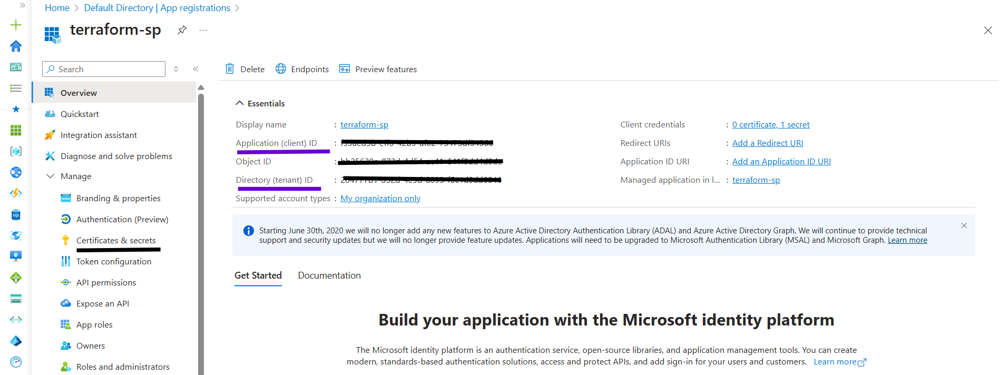
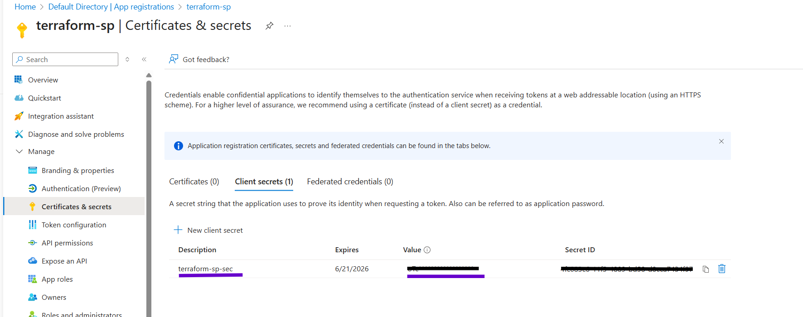
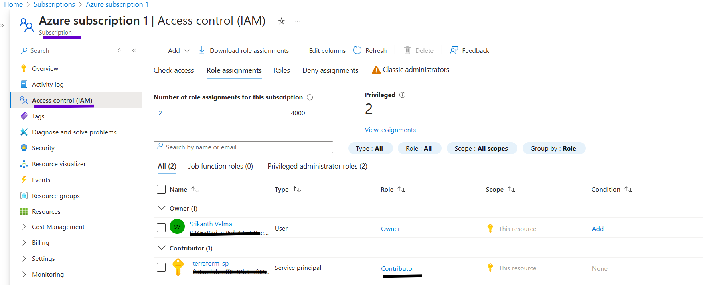

# TERRAFORM
## What is Terraform?
* Terraform is a Infrastructure as Code (IaC) tool that is used to manage and provision infrastructure resources.
## Why Terraform?


## Installation
[Refer] (https://developer.hashicorp.com/terraform/install)  To install terraform based on OS
* First we should configure the Cloud Cli (Azure Cli / Aws Cli / Gcloud)

### Windows
* Download the terraform.exe from [here](https://developer.hashicorp.com/terraform/install) 
* Extract the zip file and copy to another folder
* Add the terraform.exe to the system path - start Menu -> Edit system variables -> system properties -> advanced -> environment variables -> system variables -> path -> edit -> click on new -> add the path of terraform.exe -> click on ok.



### Linux
* For UBUNTU
```bash
wget -O - https://apt.releases.hashicorp.com/gpg | sudo gpg --dearmor -o /usr/share/keyrings/hashicorp-archive-keyring.gpg
echo "deb [arch=$(dpkg --print-architecture) signed-by=/usr/share/keyrings/hashicorp-archive-keyring.gpg] https://apt.releases.hashicorp.com $(grep -oP '(?<=UBUNTU_CODENAME=).*' /etc/os-release || lsb_release -cs) main" | sudo tee /etc/apt/sources.list.d/hashicorp.list
sudo apt update && sudo apt install terraform
```
## Azure Authentication & Authorization
* First we should install the Azure Cli
```bash
sudo apt update && sudo apt install azure-cli
```
* Login to Azure
```bash
az login
```
* Set the Service Priciple for Terraform to authenticate
* Create a Service Principal and assign the Contributor role to it
```bash
az ad sp create-for-rbac --role="Contributor" --scopes="/subscriptions/{subscription_id}"
```
* OR USE GUI
* Goto - Micriosoft EntraID -- App registrations -- New registration -- Name -- Register
* Goto - Micriosoft EntraID -- App registrations -- New registration -- Name -- Register -- Overview -- Make a note of the Application (Client) ID and Directory (Tenant) ID.
 

* Goto - Created SP - Certificates & secrets -- New client secret -- Name -- Add -- Value -- 
Make note of the Client Secret Value - It can not be retrieved again.

* Goto - Subscriptions -- IAM -- Roles -- Assign roles -- Select -- Contributor -- Select -- Save -- to this created SP

* Export the values to the environment variables in the host where you running terraform, so that it will create Azure resources through this Service Principle we created.
* For Linux Host
```bash
export ARM_CLIENT_ID="<client_id>"
export ARM_CLIENT_SECRET="<client_secret>"
export ARM_SUBSCRIPTION_ID="<subscription_id>"
export ARM_TENANT_ID="<tenant_id>"
```
* For Windows Host
```bash
$env:ARM_CLIENT_ID="<client_id>"
$env:ARM_CLIENT_SECRET="<client_secret>"
$env:ARM_SUBSCRIPTION_ID="<subscription_id>"
$env:ARM_TENANT_ID="<tenant_id>"
```


