# Basic Workflow of Terraform
* We will try to create a simple resource using terraform and explore the basic workflow of terraform
    * Create a resource - writing the terraform code
    * Initialize the terraform - terraform init
    * Validate the terraform - terraform validate
    * Format the terraform - terraform fmt
    * Plan the terraform - terraform plan
    * Apply the terraform - terraform apply
    * Destroy the terraform - terraform destroy

## terraform code
* We will try to create a azure storage account using terraform

```tf
terraform {
    required_providers {
        azurerm = {
            source = "hashicorp/azurerm"
            version = "~> 4.57.0"
        }
    }
    required_version = "=> 1.14.0"
}

provider "azurerm" {
    features {}
}

resource "azurerm_resource_group" "sa-group" {
    name = "rg-storage-account"
    location = "Central India"

}

resource "azurerm_storage_account" "sa" {
    name = "sa-practice1"
    resource_group_name = azurerm_resource_group.sa-group.name
    location = azurerm_resource_group.sa-group.location 
    account_tier = "Standard"
    account_replication_type = "LRS"

    tags = {
        environment = "dev"
    }
  
}
```
* we have configure azure account in the host - where we run the terraform commands
* ```az login```
## Terraform init
* ```terraform init``` - it initializes the terraform provider and other files to run
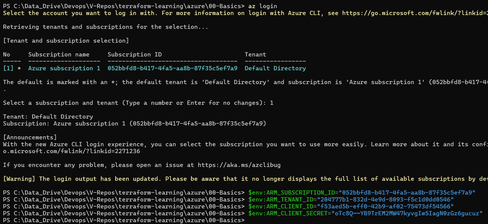
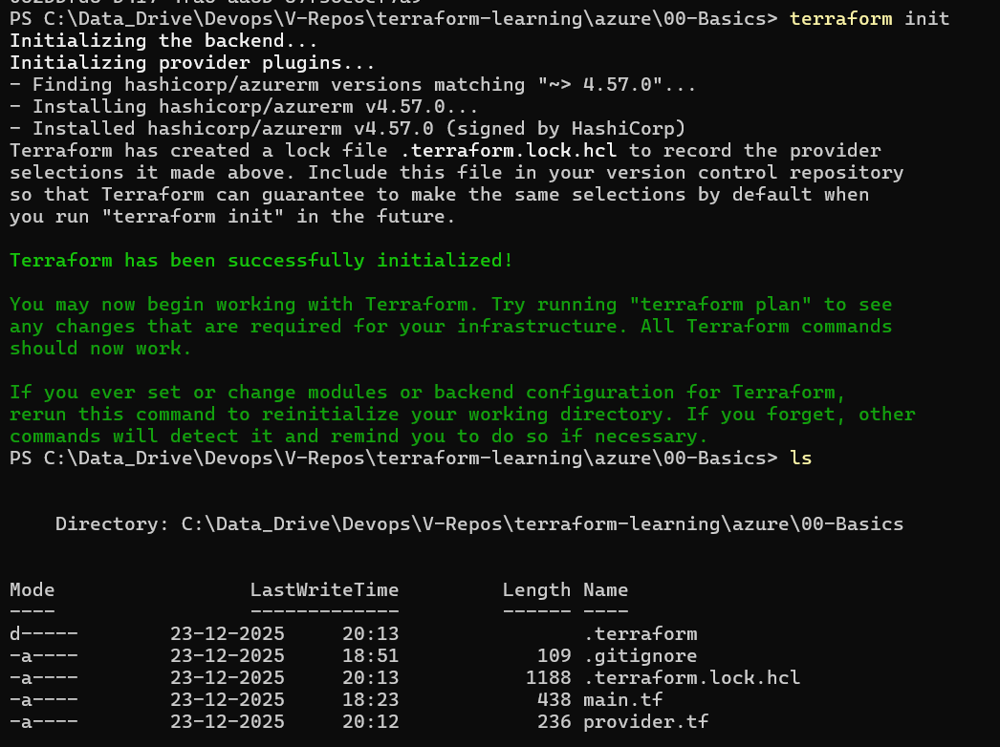

## Terraform Validate
* ```terraform validate``` - it validates the basic syntax and basic rules

## Terraform Format
* ```terraform fmt ``` - it will format the terraform code - spacing and alignment
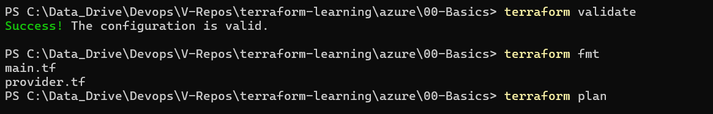

## Terraform Plan
* ```terraform plan``` - it will check the resources and what are all going to be created. it will show a plan of all that are going to be created.
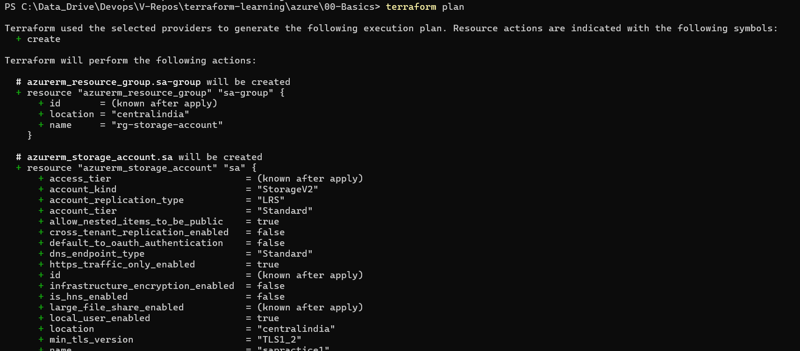
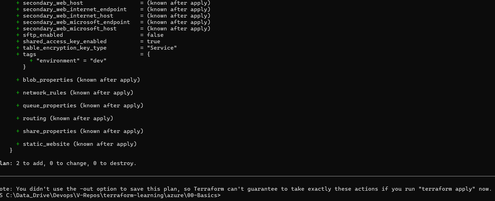

## Terraform Apply
* ```terraform apply``` - after plan, it will start creating the all resources as per the code. we might get errors here, as if any dependencies are not defined.
* ```terraform  apply --auto-approve``` - can be used to directly approve to create. otherwise it will ask us to enter - yes/no
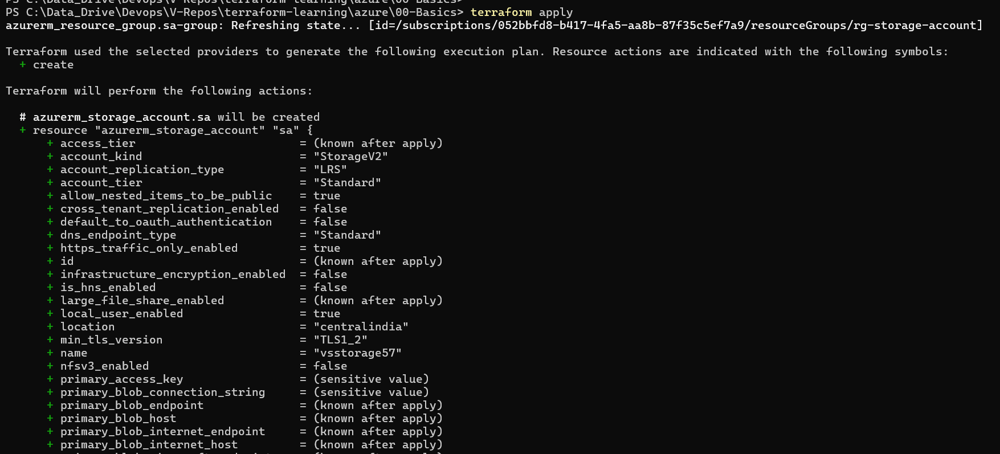
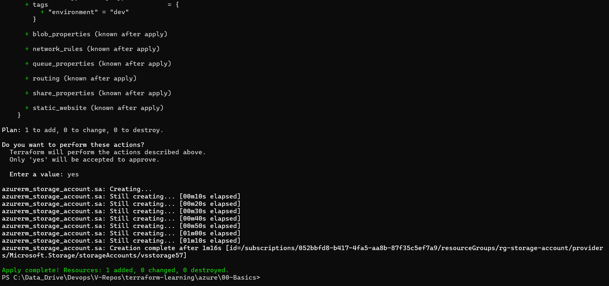
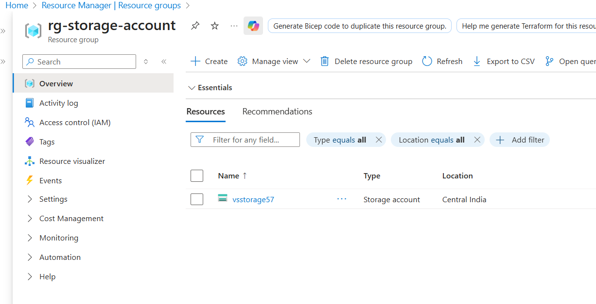
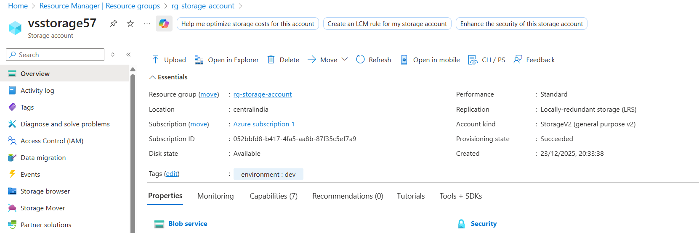

## Terraform Destroy
* ```terraform destroy``` - it will destroy all resources that are created.
* ```terrraforn destroy --auto-approve``` - can be used to auto approve
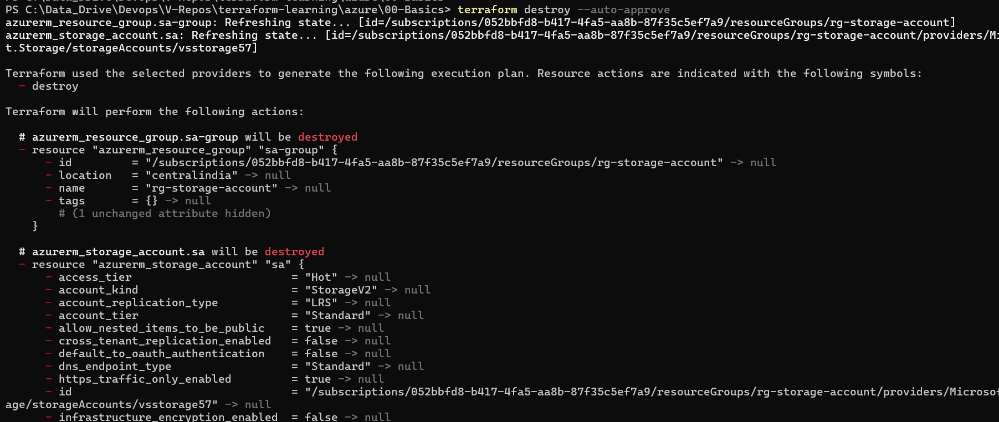
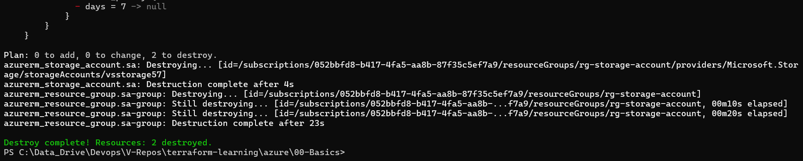

