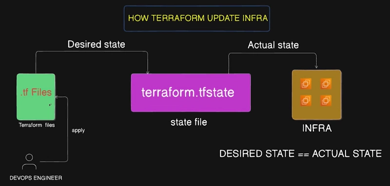
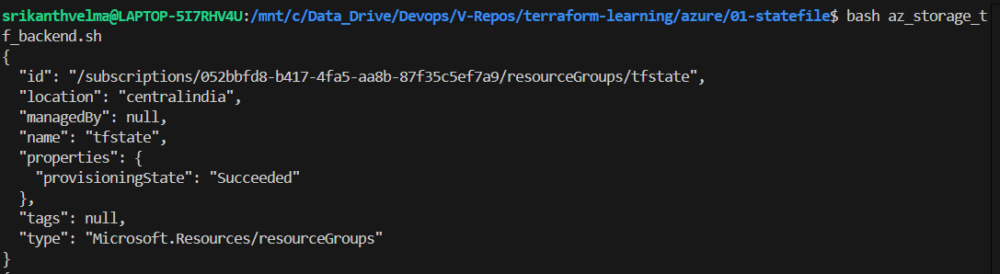
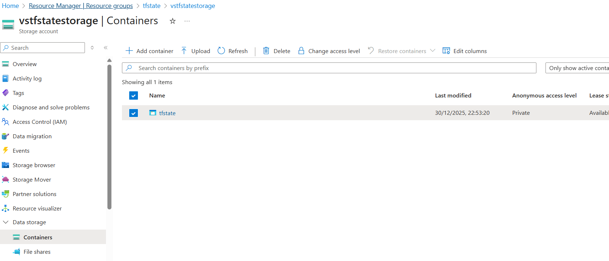
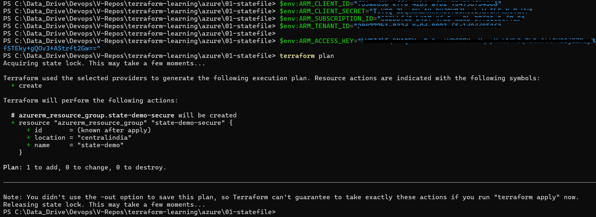
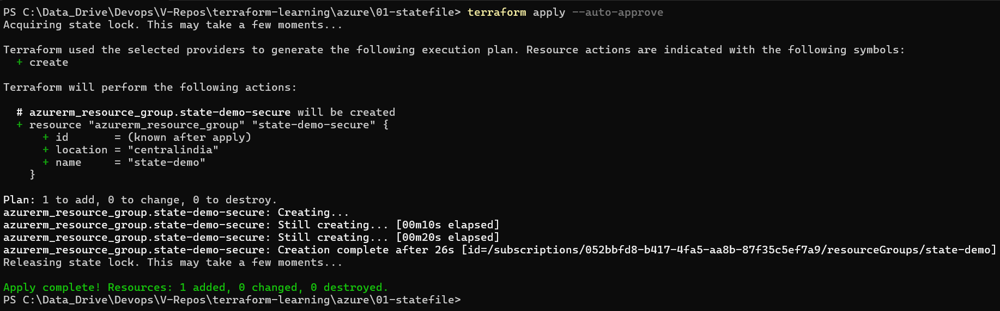
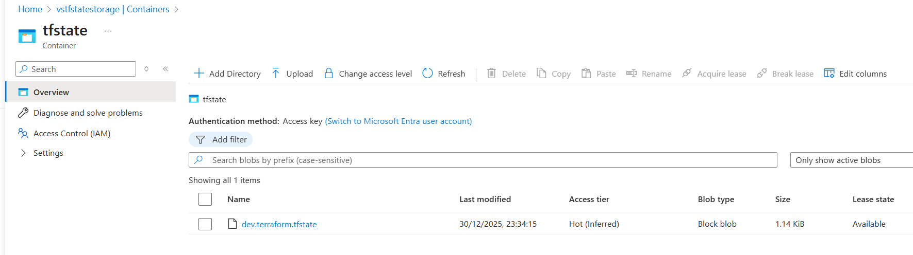

# Terraform State File
## Introduction
* Terraform state file is a file that is used to store the state of the resources that are created.
* Terraform needs a reference file to know what resources are created and what resources are need to be created/updated/deleted.
* Terraform state file is a json file that is stores all metadata of the resources that are created.
* when we apply the terraform configuration, terraform will create a state file if it is not present or first time, then after it will refer this state file and Desired state (tf files) to create the resources.

* As this contains all metadata of the resources that are created, it is very important to keep this file safe and secure.
* We can store this file in the cloud or in the local machine, but it is recommended to store it in the cloud/remote state.
* We can store the state file in the cloud using Azure Blob Storage, AWS S3, Google Cloud Storage, etc.
## Remote State
* Remote state is a state file that is stored in the cloud.
* We can store the state file in the cloud using Azure Blob Storage, AWS S3, Google Cloud Storage, etc.
## Best Practices
* We should use remote state to store the state file.
* Do not update/delete the state file manually.
* We should use versioning to store the state file.
* We should use locking to prevent multiple users from updating the state file at the same time.
* Isolated state file for each environment like dev, test, prod.
* Regularly backup the state file.
## State file Locking
* State file locking is a feature that is used to prevent multiple users from updating the state file at the same time.
* It is a recommended feature to use in the production environment.
* Azure and GCP Storage provides this feature out of the box.
* For AWS S3, we need to use S3 Bucket Locking by using DyanmoDB.
## State file - remote in Azure Blob Storage
* We can store the state file in the Azure Blob Storage.
* We need to create a Storage Account in Azure and then create a container in it.
```powershell
az resource group create --name <resource-group-name> --location <location>
az storage account create --name <storage-account-name> --resource-group <resource-group-name> --location <location> --sku Standard_LRS
az storage container create --name <container-name> --account-name <storage-account-name>
```
Example
```sh
#!/bin/bash

RESOURCE_GROUP_NAME="tfstate"
LOCATION="central india"
STORAGE_ACCOUNT_NAME="vstfstatestorage"
CONTAINER_NAME="tfstate"

# Create resource group
az group create --name $RESOURCE_GROUP_NAME --location $LOCATION

# Create storage account
az storage account create --name $STORAGE_ACCOUNT_NAME --resource-group $RESOURCE_GROUP_NAME --location $LOCATION --sku Standard_LRS

# Create storage blob container
az storage container create --name $CONTAINER_NAME --account-name $STORAGE_ACCOUNT_NAME
```


## Configure Terraform to use Azure Blob Storage
* Then we need to configure the terraform to use this storage accountin the provider block.
* **storage_account_name**: The name of the Azure Storage account.
* **container_name**: The name of the blob container.
* **key**: The name of the state store file to be created.
* we need export as a environment variable the storage access key.
* **access_key**: The storage access key.
```powershell
$env:ARM_ACCESS_KEY = "<storage-access-key>"
```
* If we are using Service principal,  we need export required azure creds as environment variables.
```powershell
$env:ARM_CLIENT_ID = "<client-id>"
$env:ARM_CLIENT_SECRET = "<client-secret>"
$env:ARM_SUBSCRIPTION_ID = "<subscription-id>"
$env:ARM_TENANT_ID = "<tenant-id>"
```
```tf
terraform {
  required_providers {
    azurerm = {
      source  = "hashicorp/azurerm"
      version = "~> 4.57.0"
    }
  }
  backend "azurerm" {
      resource_group_name  = "tfstate"
      storage_account_name = "vstfstatestorage"
      container_name       = "tfstate"
      key                  = "dev/terraform.tfstate"
  }
  required_version = ">= 1.14.0"

}

provider "azurerm" {
  features {}
}

resource "azurerm_resource_group" "state-demo-secure" {
  name     = "state-demo"
  location = "central india"
}

```





